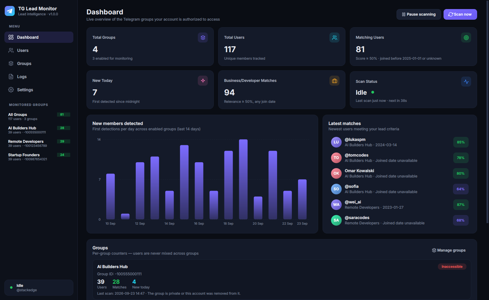
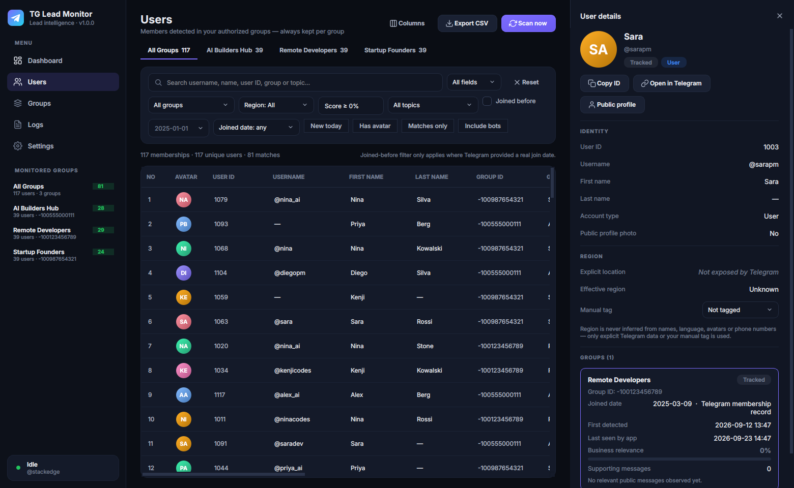

# TG Lead Monitor

A desktop app (Python + PySide6 + Telethon) that monitors the Telegram groups your account already belongs to. It finds members who are relevant to software development, AI, SaaS, startups, freelancing and hiring, keeps every result tied to the group it came from, and sends a desktop notification when a new matching user shows up.



<sub>Screenshots use generated sample data.</sub>

---

## What it does (and deliberately does not do)

| Does | Does not |
|---|---|
| Uses only the official Telegram API through Telethon, signed in as **you** (or your bot) | Bypass permissions, privacy settings, rate limits or access controls |
| Processes only groups your account is a member of **and** that you enabled | Read private one-to-one chats or join groups for you |
| Reads join dates only from Telegram's own membership records and join events | Invent join dates. Unknown dates stay `NULL` and show as **"Joined date unavailable"** |
| Takes region only from an explicit Telegram location field or your manual tag | Infer location, gender, age, ethnicity or nationality from names, language, avatars or phone numbers |
| Shows public profile photos for visual identification | Run any image analysis |
| Keeps at most 3 short snippets per user and group, with emails, phone numbers and links redacted | Store message history |
| Respects FloodWait, spaces out API calls and re-reads member lists only every 30 min | Poll the full member list every minute |

---

## 1. Create your Telegram API credentials

You need your own `api_id` and `api_hash`. They belong to your Telegram account and are free.

1. Open **https://my.telegram.org** in a browser.
2. Enter the phone number of your Telegram account in international format (for example `+15551234567`), then click **Next**.
3. Telegram sends a confirmation code **inside the Telegram app** (from the "Telegram" service account), not by SMS. Type it into the website and sign in.
4. Click **API development tools**.
5. Fill in the form if it appears (you only do this once):
   - **App title**: for example `TG Lead Monitor`
   - **Short name**: 5–32 letters or digits, for example `tgleadmonitor`
   - **URL**: leave empty
   - **Platform**: `Desktop`
   - **Description**: optional
6. Click **Create application**.
7. Copy **App api_id** (a number) and **App api_hash** (a 32-character string).

Treat the `api_hash` like a password. Don't share it or commit it.

> Optional bot mode: create a bot with [@BotFather](https://t.me/BotFather) (`/newbot`) and add it to your groups. Telegram doesn't let bots read chat history, and member lists are often unavailable to them, so bots only see joins and messages that arrive while the app is running. Signing in with your own account gives much better results.

---

## 2. Install

Requirements: **Python 3.10 or newer** on Windows, macOS or Linux.

```bash
git clone <this repository>
cd telegram_bot

python -m venv .venv
# Windows:        .venv\Scripts\activate
# macOS / Linux:  source .venv/bin/activate

pip install -r requirements.txt
```

On **Linux**, Qt also needs a few system libraries. On Debian or Ubuntu:

```bash
sudo apt install libxcb-cursor0 libxkbcommon-x11-0 libegl1
```

---

## 3. Configure

```bash
cp .env.example .env        # Windows: copy .env.example .env
```

Edit `.env`:

```ini
TELEGRAM_API_ID=1234567
TELEGRAM_API_HASH=0123456789abcdef0123456789abcdef
TELEGRAM_PHONE=+15551234567
```

You can also leave `.env` empty and enter everything later in **Settings → Telegram API**. The app writes it to `.env` for you. On macOS and Linux the file is created with owner-only permissions (`600`).

---

## 4. Start the application

```bash
python -m app.main
```

Useful options:

```bash
python -m app.main --minimized            # start hidden in the system tray
python -m app.main --debug                # verbose logs (also printed to the console)
python -m app.main --data-dir ./data      # keep database/session/logs in a custom folder
```

### First run

1. **Settings → Session → Sign in.** Enter your phone number and click **Send verification code**.
2. Type the code Telegram sends to your Telegram app. If your account has two-step verification, the dialog then asks for your cloud password.
3. After you sign in, the app lists the groups and channels your account belongs to. Private chats are skipped.
4. On the **Groups** page, switch on the groups you want to monitor. You can also add a group you're already a member of by `@username`, `t.me/...` link or `-100…` ID.
5. Scanning starts right away and then repeats every 60 seconds. Watch it on the **Dashboard** and the **Logs** page.

The session is saved, so you only sign in once per computer. Use **Settings → Sign out** to revoke it and delete the local session file.

---

## Using the app

- **Dashboard**: shows Total Groups, Total Users, Matching Users, New Today, Business/Developer Matches and live Scan Status. It also has a 14-day detections chart, the latest matches and a counter card for each group. Click any card to jump to the filtered list.
- **Users**: has an *All Groups* tab plus one tab per group, and the sidebar also works as a group selector. Filters cover group, joined-before date, region, relevance score, topic, username or user ID (search scope), new today, has avatar, and joined date known/unknown. You can also show matches only or include bots. Click a column header to sort, and use **Columns** to show or hide columns.
- **User detail drawer**: opens when you click a row. It shows the avatar, IDs and names, and every group the user was seen in, each with its own joined date, first-detected date, last-seen time, score, topics and redacted evidence. From here you can also tag the user's region by hand. **Public profile** reads the public bio and any explicit Telegram Business location once, on demand.
- **Export CSV**: exports exactly the rows that are currently filtered, with the columns User ID, Username, First Name, Last Name, Group ID, Group Name, Joined Date, First Detected Date, Last Seen, Region, Relevance Score and Topics.
- **Logs**: shows scan start and finish, each group scanned, users processed, new users, rate-limit waits, API errors and reconnects. The full log is also written to `logs/monitor.log`.
- **Settings**: API ID and hash (masked, with a reveal button), session status, polling interval, member-list refresh interval, first-scan backfill, minimum relevance score, joined-before date, monitored groups, desktop notifications (with a test button) and startup behaviour (scan on launch, start minimized, keep running in the tray).

Keyboard shortcuts: `F5` scans now, `Ctrl+F` jumps to search, `Ctrl+1…5` switches pages, and `Esc` closes the drawer.

### What counts as a match

A user matches in a given group when **all** of these are true:

- `relevance_score ≥ minimum relevance score` (default 50), and
- the account isn't a bot or a deleted account, and is still in the group, and
- **either** Telegram gave a real join date that is before the joined-before date (default `2025-01-01`), **or** the join date is unknown. Unknown dates are shown as "Joined date unavailable" and are never treated as the first-detected date.

"Business/Developer Matches" counts users over the score threshold regardless of join date.

### Join dates

| Source | When Telegram provides it |
|---|---|
| `participant_record` | Member lists of supergroups and basic groups include the date a regular member joined (admins' dates are *promotion* dates, so they are ignored) |
| `join_event` | "X joined" or "X added Y" service messages and live join updates |
| *(none)* | Everything else. `joined_date = NULL`, and `first_detected_at` holds the moment the app first saw the user |

### Relevance score

`app/services/relevance.py` is a transparent keyword classifier with 16 topics: Software Development, Web, Mobile, AI/ML, SaaS, Startups, Freelancing, Remote Work, Hiring & Jobs, Business Collaboration, Product Development, DevOps, Cloud, Backend, Frontend and Full-Stack.

Only text that is visible in the enabled groups is analysed, plus the public username and display name (for example `JohnDev`). Each message adds to per-topic hit counts. The score (0–100) grows with the number of hits (logarithmically), with a bonus for covering several topics, and levels off near 100.

For each user and group the app stores `relevance_score`, `detected_topics`, `supporting_messages_count` and up to three redacted evidence snippets.

### Notifications

When a user becomes a match, the app sends a native notification through the system tray, for example:

```
New Telegram Lead Found
JohnDev
Group: Remote Developers
Relevance: 87%
Joined date unavailable
```

Each `user_id + group_id` pair is notified only once; this is enforced by a unique constraint in SQLite. After a large first scan you get the first three notifications plus one summary. If the desktop has no system tray (some Linux setups), an in-app toast is shown instead. GNOME needs the *AppIndicator* extension for tray icons.

---

## Architecture

```
app/
  main.py                 entry point: logging, Qt app, database, worker, main window
  config.py               paths, .env credentials, settings.json (validated and clamped)
  telegram/
    client.py             TelegramClient lifecycle, session file hardening, connect timeout and backoff
    auth.py               phone → code → 2FA password flow, bot token login, logout
    groups.py             discover joined groups, resolve @username/link/ID, explicit group location
    members.py            participants → records (real join dates only), message/service-action extraction
    events.py             live NewMessage/ChatAction handlers, limited to enabled groups (never private chats)
    rate_limit.py         minimum spacing between calls, FloodWait sleep/raise
  services/
    worker.py             QObject bridge: its own asyncio loop in a thread; Qt signals to the UI
    scanner.py            1-minute cycle: incremental history, throttled member sync, error isolation per group
    ingest.py             Telethon-independent writes, keyed by (user_id, group_id)
    relevance.py          topic classifier, scoring, redacted snippets
    notifications.py      de-duplicated lead notifications
    avatar_service.py     cached small profile photos, re-downloaded only when the photo ID changes
    region.py             explicit location text → US / EU / Other
    export.py             CSV export (with protection against formula injection)
    logging_service.py    rotating file log plus a live feed for the Logs page
  database/
    db.py                 per-thread SQLite connections, WAL, transactions
    migrations.py         versioned schema and indexes
    models.py             dataclasses
    repositories.py       all SQL: groups, users, memberships, relevance, notifications, UI queries
  ui/
    main_window.py        sidebar and group selector, page stack with fade transitions, tray, shortcuts
    dashboard.py          KPI cards (animated), bar chart, latest matches, per-group tiles
    users_page.py         group tabs, filter bar, table model and custom delegates, CSV export
    user_details.py       animated right-side drawer
    groups_page.py        discover/add/enable/remove groups with per-group counters
    logs_page.py          filterable live log
    settings_page.py      masked credentials, session, scanning, criteria, groups, notifications, startup
    login_dialog.py       sign-in wizard
    theme.py, widgets.py  design tokens, stylesheet, toggle switch, stat cards, toasts, flow layout
  resources/icons/        SVG icons
tests/                    pytest suite (database, classifier, scanner with a fake Telegram client)
```

**Threading.** Telethon runs on its own asyncio event loop in a background thread. The UI calls thread-safe methods such as `scan_now()` and `request_code()`, and gets results back through Qt signals, so the window never blocks on the network.

**Rate limits and performance:**

- Each cycle reads only messages newer than the stored `last_message_id`.
- The full member list is re-read only every `member_sync_minutes` (default 30).
- Live updates cover the time between cycles.
- A `processed_messages` table makes sure no message is counted twice.
- API calls are spaced out (0.35 s by default). When Telegram asks the app to wait (FloodWait), it waits up to 15 minutes and shows *Rate limited*. Longer waits postpone only that group's work until a later cycle.
- Avatars are downloaded in small batches per cycle.
- SQLite runs in WAL mode with indexes on group, user, dates and score.

**Error handling:**

- **Network drops:** reconnect with backoff, capped at 2 min, plus a 45 s connect timeout.
- **Revoked or expired session:** the app asks you to sign in again.
- **Groups you can no longer access:** marked *Inaccessible* with the reason, and the other groups keep going.
- **Deleted accounts:** flagged and excluded from matches.
- **Broadcast channels:** these expose members only to admins, so monitor their discussion group instead.

### Database tables

`telegram_groups`, `telegram_users`, `group_memberships` (one row per user per group, with `joined_at`, `joined_at_source`, `first_detected_at`, `last_seen_at`, `left_at`), `user_relevance` (per user per group), `notifications` (unique per user and group), and `processed_messages` (IDs only, pruned after 30 days).

### Where data is stored

| OS | Folder |
|---|---|
| Windows | `%APPDATA%\TelegramLeadMonitor` |
| macOS | `~/Library/Application Support/TelegramLeadMonitor` |
| Linux | `~/.local/share/telegram-lead-monitor` |

This folder holds `monitor.db`, `settings.json`, `sessions/telegram.session`, `avatars/`, `logs/` and `exports/`. On macOS and Linux the folder is created with mode `700` and the session file with mode `600`. The session file gives full access to your Telegram account, so keep it private and use **Sign out** on computers you no longer use.

---

## Running the tests

```bash
pip install -r requirements-dev.txt
python -m pytest -q
```

## Troubleshooting

| Symptom | Fix |
|---|---|
| "API credentials required" | Enter your API ID and hash in Settings, then click **Save credentials & reconnect** |
| `API_ID_INVALID` | The ID and hash don't match. Copy both again from my.telegram.org |
| Code never arrives | Check the Telegram app on your phone or desktop, not SMS. Wait a minute before requesting another code |
| "Rate limited" in Scan Status | Telegram asked the app to wait. It resumes by itself; you can also raise the polling interval |
| Group shows *Inaccessible* | You left the group, were removed, or it became private. Rejoin it in Telegram or remove it from the app |
| Member count stays low | Some groups hide their member list from non-admins. The app then learns members from visible messages and join events |
| `qt.qpa.plugin: Could not load the Qt platform plugin "xcb"` (Linux) | `sudo apt install libxcb-cursor0` |
| No native notifications on Linux | Enable a system tray (for example the GNOME AppIndicator extension). In-app toasts are used in the meantime |

## Responsible use

Use this tool only in groups where you're a legitimate member, and follow Telegram's Terms of Service, the [API Terms of Service](https://core.telegram.org/api/terms) and applicable privacy law (for example GDPR for EU residents). Don't use the results for unsolicited bulk messaging.
